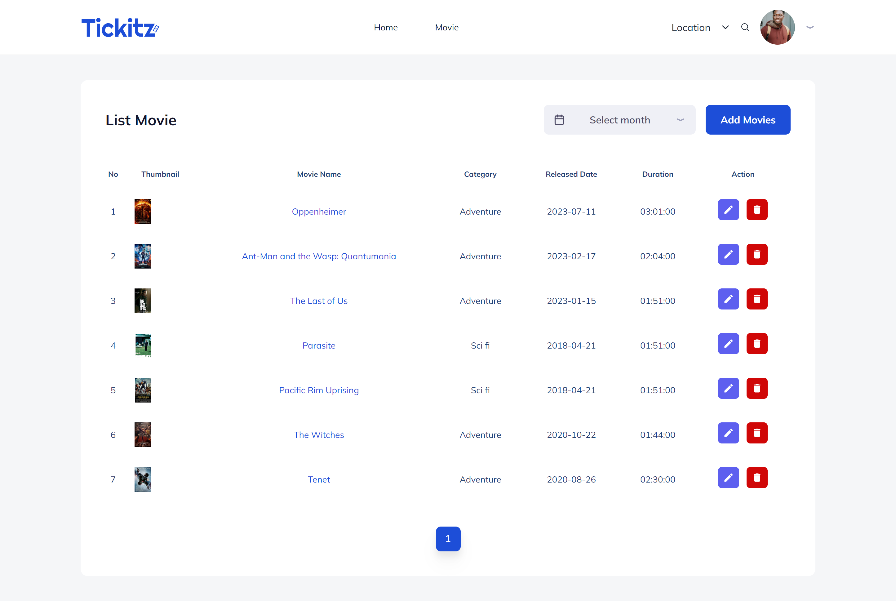

# Tickitz Movie With React JS

        </img>

A Front End project for ordering movie ticket and transactions online. The main feature in this project is using a Single Page Application (SPA), Dynamic Web and Responsive website for mobile, tablet and laptop.

## Built With

- [React JS](https://go.dev/)
- [Tailwind CSS](https://tailwindcss.com/)
- [Redux](https://redux.js.org/)
- [Chart JS](https://www.chartjs.org/)

## Configure app

Create file `.env` then edit it with your settings
according to your needs. You will need:

<pre>
<code>
VITE_BACKEND_HOST = Your Backend Golang Host
</code>
</pre>

## Install And Run Locally

1.  Clone project from github repository

        $ git clone https://github.com/ridwanbahtiar15/Tickitz-Frontend

2.  go to folder coffee-shop-react-vite

        $ cd Tickitz-Frontend

3.  install dependencies

        $ npm install

4.  Prepare Backend

    prepare the backend in the following link [Back End With Golang](#link)

5.  Start the server

        $ npm run dev

## Screenshot

| Login                                                                       | Home                                                                        |
| --------------------------------------------------------------------------- | --------------------------------------------------------------------------- |
|  |  |

| Movie Detail                                                                | Product Movie Book Seat                                                     |
| --------------------------------------------------------------------------- | --------------------------------------------------------------------------- |
|  |  |

| Profile                                                                     | List Movie                                                                  |
| --------------------------------------------------------------------------- | --------------------------------------------------------------------------- |
|  |  |

## Link Deployment

[Tickitz](tickitz-frontend-eight.vercel.app)

## Related Project

[Back End With Golang](https://github.com/ridwanbahtiar15/Tickitz-Golang)

## Collaborator

[Gilang Rizaltin](https://github.com/GilangRizaltin)
